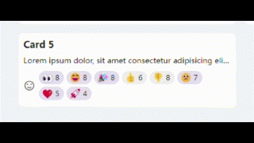

<p align="center">
    
</p>
<p align="center">
  <a href="https://github.com/boring-plans/emoji-reaction/blob/main/LICENSE"></a>
  <a href="https://npmjs.com/package/emoji-reaction"></a>
  <a href="https://github.com/boring-plans/emoji-reaction/actions/workflows/cd.yml?query=branch%3Amain"></a>
</p>

# Emoji Reaction

`Emoji Reaction` is a [Vue3](https://vuejs.org/) based emoji reaction component.

<p align="center">
    
</p>


# Demo

[Here](https://tkzt.cn/emoji-reaction) is a demo.


## Before Everything

**A Vue3 project**
## Installation

Install `Emoji Reaction` with npm:

```bash
npm install emoji-reaction
```


## Usage/Examples

For version 1.x, we've got a built-in LeanCloud:

```html
<template>
    <div class="card">
        <emoji-reaction
            react-to="whom-to-react-to"
            reactor="who-react"
            lc-app-id="leancloud-app-id"
            lc-app-key="leancloud-app-key"
            :emojis="['👍', '👎', '😄', '🎉', '😕', '❤️', '🚀', '👀']"
        />
    </div>
</template>
<script lang="ts" setup>
import { EmojiReaction } from 'emoji-reaction';
</script>
```

But due to some easy-to-use reasons, for 2.x, LeanCloud is not built-in any more. Giving three appointed function props is needed:


```html
<template>
    <div class="card">
        <EmojiReaction
            :reactor="whom-to-react-to"
            :react="(reaction)=>{
                // request to react
            }"
            :unreact="(reaction)=>{
                // request to cancel
            }"
            :getReactions="()=>{
                // request reactions to a certain key
                return []
            }"
        />
    </div>
</template>
<script lang="ts" setup>
import { EmojiReaction } from 'emoji-reaction';
</script>
```

<small>* emojis by default are ['👍', '👎', '😄', '🎉', '😕', '❤️', '🚀', '👀']</small>

Related definitions:

```ts
interface Reaction {
  reaction: string;
  reactors: string[];
}

export interface Props {
  emojis?: string[];
  reactor: string;
  react: (reaction: string)=>Promise<unknown>;
  unreact: (reaction: string)=>Promise<unknown>;
  getReactions: ()=>Promise<Reaction[]>;
}
```

For details, check [this](https://github.com/boring-plans/emoji-reaction/blob/main/examples/App.vue) out (Take LeanCloud as an example).

What's more, we can register EmojiReaction globally:

```ts
import { createApp } from 'vue';
import App from './App.vue';
import EmojiReaction from 'emoji-reaction';

createApp(App).use(EmojiReaction).mount('#app');
```

And a cdn-way is also supported:

```
<script src="https://cdn.jsdelivr.net/npm/emoji-reaction@latest/lib/index.min.js"></script>
```

## Customization

```css
:root {
    --er-primary: #5E35B137;
    --er-primary-light: #5E35B125;
    --er-primary-dark: #5E35B1a6;
}
```
